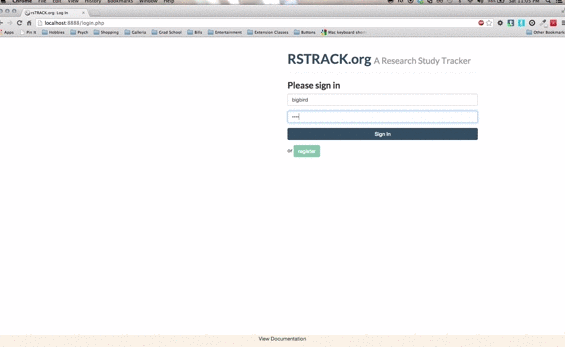
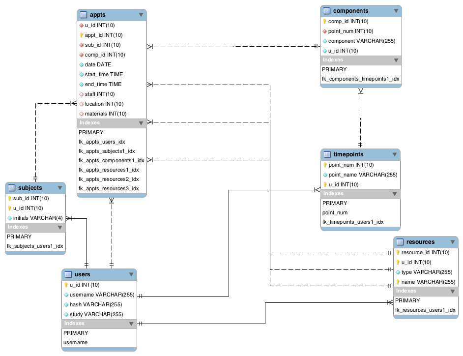

[rsTRACK.org](http://www.rstrack.org)
==========
A Fall 2013 [CS50](http://cs50.harvard.edu/) Final Project

rsTRACK is a PHP-, jQuery-, and Bootstrap- driven web application built to track all appointments booked for a clinical research study, tailored for clinical research coordinators and assistants. RSTRACK was created to assist in:

- Scheduling study appointments
- Tracking subject progress to completion
- Tracking how your study's resources are being utilized

Database
==========

Features
==========

1. The My Study Page - Build your Study
---------------------------------------
Use the My Study page to build the framework of your study.

###Timepoints
The typical framework of a clinical research study, especially those that are longitudinal, consists of timepoints that each call for certain components to be completed by all subjects. On the My Study page, add timepoints that are fundamental to study design.

For instance, do each of your subjects complete a baseline timepoint? Are they followed up with a year later? Then adding two timepoints named "Baseline" and "1-Year" might be a good start!

###Components
Once your timepoints are set, add components to each. Components are the parts of your study that must occur at a certain timepoint. For instance, all clinical studies must have at minimum a consent. Since a consent must happen at baseline, you could add a "Consent" component to the "Baseline" timepoint and not to the "1-Year" timepoint.

Create components that are likely to be completed in separate study appointments to eventually complete all that's required for its parent timepoint. Is a single subject asked to participate in an interview, a blood draw, and cognitive testing, but only at Baseline? Then create separate "Interview", "Blood Draw", and "Cognitive Testing" components for the "Baseline" timepoint. Is only the "Interview" completed at the "1-Year" timepoint? Then add it as another component for that follow-up timepoint.

Once you have added all your timepoints and components, you are ready to move on to the Resources page. But don't forget about the My Study page! It is your central control page for adding timepoints, renaming them, and adding, editing, or deleting components as needed.

2. The Resources Page - Utilization Tracking
--------------------------------------------
Now that you have the timepoints and components set up for your study, go to the Resources page to add the resources your study uses for appointments.

Components allocate three typical types of resources built into the site. Here they are listed with examples of each:

1. Staff - the names of clinicians, radiologists, assistants, or psychometricians
2. Locations - specific room numbers, hospitals, clinics, or offices
3. Materials - interview binders, biological sampling kits, cognitive testing  kits, or consent forms

Resources are not committed to certain components or timepoints, nor each other. A staff member will be free to utilize any location using any materials for any appointment. As a result, clinicians can be assigned to a cognitive testing or a blood draw appointment if they happen to be trained for both. Sampling kits or interview binders can be utilized at Baseline or 1-Year. Resources are designed for flexibility.

Consequently, the Resources page is simple. Add a row to add a resource. Select an existing resource row to edit its type or name. You can delete resources to, but keep in mind they can only be deleted if they haven't been utilized for any appointments.

3. The Subjects Page 
---------------------

Add, edit, or delete subjects from the Subjects page.

###Subject IDs
Subject IDs are typed in because ID assignment can change or skip order in a study for a multitude of reasons. Perhaps you only want to track subjects found eligible, omitting IDs that don't make it into the study. Or maybe there is a subject coding scheme unique to your study, such as odd numbers for eligible and even for ineligible, a required number of leading zeros, or prefixes for multi-site studies.

This is why you can simply type in any desired subject ID. The only requirements are that they are 1) in number form and 2) unique.

###Privacy
The initials field is the only other value you can enter for a subject. This is because HIPAA guidelines require privacy for any information that can identify a patient or research participant. rsTRACK.org is built to track subjects anonymously, so subject attributes like gender, address, health status, and so on are omitted to minimalize risk of mistaken disclosure.

If you use rsTRACK.org for coordination, keep identifiable information separately. Check your research protocol or consent form for the specific policies enforced by your institution and/or research group.

4. The Appointments Page
------------------------
The Appointments page is where you can view all study goings on in one place.

###Book Appointments
Each row represents an appointment. Add a row to book a new (or log an old) appointment. Each can consist of:

* Subject ID - Select from a dropdown list of your study's subject IDs. The Initials field will automatically update based on your selection.
* Initials - You can select the subject by initals as well. The Subject ID field will automatically update too.
* Timepoint and Component - Select which component the appointment is for and for which timepoint. These are joined together so you don't pick a component for the wrong timepoint or vice versa.
* Date - Select the date of the appointment from a dropdown calendar. This field can be left blank, so you can track the need for an appointment before your team has finalized a date for it.
* Start & End Time - Enter a start and end time for your appointment. These fields can also be left blank in case you'll finalize a time later.
* Staff - Select the staff member that will be responsible for running the subject through the appointment's chosen component.
* Location - Select where the appointment will take place.
* Materials - What will staff need in order to complete the component? Select here.

Multiple appointments can be booked for the same timepoint & component combination. Subjects may need to come in one or more times for any given component, especially if your component is time-consuming (e.g. a 6-hour cognitive testing battery).

###Filtering Appointments
Use the filter box in the upper right-hand corner above the appointments table to filter your appointments by keyword. It will filter the table rows as you type to only those that contain your keyword. With this feature, you can customize your table view based on what you'd like to track. Enter a subject initials, for instance, to view only the appointments completed for a specific subject. Enter a staff member's name to view all the appointments they're responsible for. Enter a location name to see only the appointments that have taken place there. Enter a date if you need to find out who was seen on a particular day. With this tool, you can view only what you need to.

###Edit Appointments
Modifying appointments is simple. Select the appointment row you want to change. An edit box will appear below the appointment table. It will have all the original values filled for you to see. Make any changes in the form and click the Edit Appointment button when finished.

###Cancel Appointments
Cancelling appointments is simple as well. When you select an appointment row, a cancel box will appear below the appointment table as well. Cancellations are final and require just one click.

